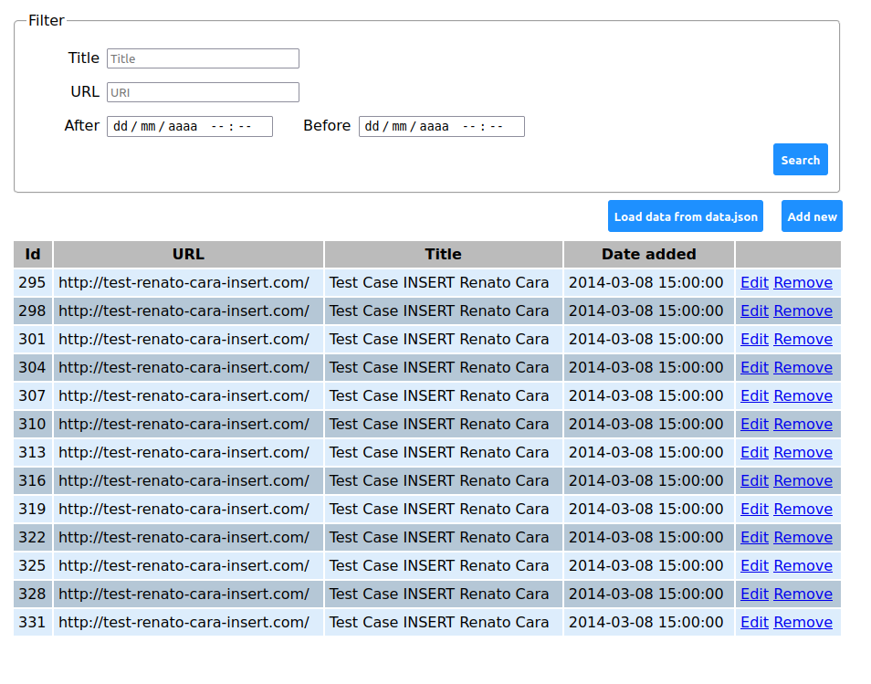

## Renato Cara Engineering Exercise 


## Running the demo
### Running with docker
Enter the root folder of the application 
```bash
docker-compose up
```
The docker compose should be able to give the server with a brand new container with an MySQL database and the application running on the specified port

If you don't have the docker compose you can install it accessing https://docs.docker.com/compose/install/


Then the access the URL 
http://localhost:5000/
To access the page of the application there you can create new registers, import from the given json file update, remove and filter the recorded data

 

the API services can be acessed (using a postman, curl orany that that makes the request)

if the docker compose needs to be rebuild use the command
```bash
docker-compose up  --force-recreate --build
```


### Running without docker

If you have already an MySQL database configured
you can specify the variables of the database (in Unix)
```bash
export MYSQL_ROOT_PASSWORD={password}
export MYSQL_DATABASE=exercise
export MYSQL_USER={user}
export MYSQL_PORT=3306
export MYSQL_HOST={host-ip}
```

```bash
pip install -r requirements.txt
python app/server.py

```

or 


```bash
pip3 install -r requirements.txt
python3 app/server.py

```

### Running tests
With  the docker up or the server you can execute the integration tests with the command

```bash
nosetests --verbose
```


## API

With a tool like postman, RestAPI or using curl you can access the APIs

> GET /data  Return all data
     <p>
    @return: 200: an array of all known items in database
    If there's nocontent the array is empty
    </p>

> GET /data/\<string:_id\>
    <p>
    Get data by it's id
    @param _id: the id
    @return: 200: a Data as a flask/response object \
    with application/json mimetype.
    @raise 404: if Data request not found
    </p>

> POST /data/filter
    <p>
    Filter a data request using
    { \
        "title": "", \
        "uri": "", \
        "date_before": "", \
        "date_after": "" \
    } \
    Any ofthe fields may be empty,if a field is empty 
    it is disconsidered in the filter.
    @return: 200: return flask/response object \
    with application/json mimetype.
    @raise 400: if error on request
    </p>

> POST /data
    <p>
    Create a data 
    @param application/json baseon the Model  
        {
        "title": string,
        "uri": string,
        "date": datetime
        }
    @return: 201: created .
    @raise 400: misunderstood request
    </p>
> PUT /data
      <p>
    Update a data 
    @param application/json in the structure described in class model.Data 
    @return: 200: with application/json mimetype of the updated object.
    @raise 400: misunderstood request
     </p>
> DELETE /data/\<string:_id\>
    <p>
        Delete a data request record
        @param id: the id
        @return: 204: an empty payload.
        @raise 404: if data requested not found
     </p>

> POST /data/import
     <p>
        Import a data from data.json
        @param application/json of the content in input/data.json
        @return: 201: as a flask/response object \
        with application/json mimetype with errors and 
        the quantity created.
        @raise 400: misunderstood request
     </p>


## Design considerations

For this exercise I had to make few design considerations and assumptions for simplicity, I tried to use the least amount of libraries and frameworks possible, I only used what was really necessary (the libraries are listed in requirements.txt) all the templates and pages (HTML, js and css) don't  use any external libraries. 
The API and pages may face some bugs for the purpose of the application it isn't extensively tested. In a production environment I would suggest a more robust and more reliable MySQL driver connection or even a ORM tool like SQLAlchemy, I used the more basic database driver for simlpicity.

The code is separated in models, routes, repository and service (even if the service is a bit underplayed because of how little business rules are applied)
